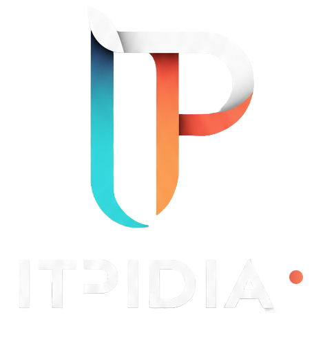

<div align="center">
  
  
  # ITPidia - Company Website
  
  ### Cutting-edge IT solutions that drive your business forward
  
  [](https://developer.mozilla.org/en-US/docs/Web/HTML)
  [](https://developer.mozilla.org/en-US/docs/Web/CSS)
  [](https://developer.mozilla.org/en-US/docs/Web/JavaScript)
  [](https://developer.mozilla.org/en-US/docs/Learn/CSS/CSS_layout/Responsive_Design)
  
  [View Demo](#) · [Report Bug](#) · [Request Feature](#)
  
</div>

---

## � Table of Contents

- [About](#about)
- [Features](#features)
- [Tech Stack](#tech-stack)
- [Getting Started](#getting-started)
- [Project Structure](#project-structure)
- [Customization](#customization)
- [Deployment](#deployment)
- [Browser Support](#browser-support)
- [Contributing](#contributing)
- [License](#license)

---

## 🎯 About

**ITPidia** is a modern, fully responsive company website built with vanilla HTML, CSS, and JavaScript. This single-page application showcases IT services with a clean design, smooth animations, and exceptional user experience across all devices.

### Key Highlights

- ⚡ **Zero Dependencies** - Pure HTML, CSS, and JavaScript
- 📱 **100% Responsive** - Optimized for mobile, tablet, and desktop
- 🎨 **Dark/Light Mode** - Seamless theme switching with localStorage persistence
- ♿ **Accessible** - WCAG 2.1 compliant with proper ARIA labels
- 🚀 **Fast Performance** - Lightweight and optimized for speed
- 🎭 **Smooth Animations** - CSS transitions and JavaScript-powered interactions

---

## ✨ Features

<table>
  <tr>
    <td>
      <h3>🎨 Modern Design</h3>
      <ul>
        <li>Clean and professional UI</li>
        <li>Cyan & Orange brand colors</li>
        <li>Smooth transitions & animations</li>
        <li>Glassmorphism effects</li>
      </ul>
    </td>
    <td>
      <h3>📱 Responsive Layout</h3>
      <ul>
        <li>Mobile-first approach</li>
        <li>Breakpoints: 768px, 1024px, 1200px</li>
        <li>Touch-friendly mobile navigation</li>
        <li>Optimized typography scaling</li>
      </ul>
    </td>
  </tr>
  <tr>
    <td>
      <h3>🌓 Theme Toggle</h3>
      <ul>
        <li>Light/Dark mode switch</li>
        <li>Persistent theme preference</li>
        <li>Smooth color transitions</li>
        <li>System preference detection</li>
      </ul>
    </td>
    <td>
      <h3>⚙️ Interactive Features</h3>
      <ul>
        <li>Smooth scroll navigation</li>
        <li>Form validation</li>
        <li>Mobile hamburger menu</li>
        <li>Scroll animations</li>
      </ul>
    </td>
  </tr>
</table>

### 📄 Page Sections

1. **Hero** - Compelling headline with animated background
2. **Features** - 4 key value propositions
3. **About** - Company story and founding year badge
4. **Services** - 6 service offerings (Web, Mobile, AI, Cloud, Digital Transformation, Custom IT)
5. **Stats** - Global presence metrics with visual map
6. **Values** - Innovation, Reliability, Partnership
7. **Outcomes** - Proven results showcase
8. **Team** - Founder profile with photo
9. **Contact** - 2-column layout with info cards & form
10. **Footer** - Social links, copyright, and address

---

## 🛠️ Tech Stack

| Technology | Purpose | Version |
|------------|---------|---------|
| **HTML5** | Semantic markup | Latest |
| **CSS3** | Styling & animations | Latest |
| **JavaScript (ES6+)** | Interactivity | ES2015+ |
| **CSS Variables** | Theme system | Native |
| **Flexbox & Grid** | Layout system | Native |
| **SVG** | Icons & logo | Inline |

### Why Vanilla Stack?

- 🎯 **No Build Process** - Works out of the box
- 📦 **No Dependencies** - No npm packages or CDN links
- ⚡ **Better Performance** - Minimal overhead
- 🔧 **Easy Maintenance** - Simple to understand and modify
- 🌐 **Universal Compatibility** - Works everywhere

---

## 🚀 Getting Started

### Prerequisites

- A modern web browser (Chrome 80+, Firefox 75+, Safari 13+, Edge 80+)
- A local development server (optional but recommended)

### Quick Start

1. **Clone or download** this repository:
   ```bash
   git clone https://github.com/yourusername/itpidia-website.git
   cd itpidia-website
   ```

2. **Open with a local server** (choose one method):

   **Method 1: VS Code Live Server** (Recommended)
   ```bash
   # Install Live Server extension in VS Code
   # Right-click index.html → "Open with Live Server"
   ```

   **Method 2: Python**
   ```bash
   # Python 3
   python -m http.server 8000
   
   # Open http://localhost:8000
   ```

   **Method 3: Node.js**
   ```bash
   npx serve .
   # or
   npx http-server
   ```

   **Method 4: PHP**
   ```bash
   php -S localhost:8000
   ```

3. **Or simply open** `index.html` in your browser for basic viewing

---

## 📁 Project Structure

```
Itpidia-Web-Site/
│
├── 📄 index.html           # Main HTML (537 lines)
├── 🎨 styles.css           # Complete stylesheet (1500+ lines)
├── ⚙️ script.js             # JavaScript functionality (600+ lines)
├── 📖 README.md            # Documentation (you are here)
│
└── 📂 assets/
    ├── 🖼️ logo.svg           # Company logo (SVG format)
    ├── 🖼️ logo_black.png     # Logo variant for About section
    └── 👤 founder.jpg        # Founder photo (Youssef Abid)
```

### Code Organization

**HTML Structure:**
- Semantic HTML5 elements (`<header>`, `<main>`, `<section>`, `<footer>`)
- ARIA labels for accessibility
- Meta tags for SEO and social sharing
- Clean, indented structure

**CSS Architecture:**
- CSS Variables for theming (`:root` and `[data-theme="dark"]`)
- Mobile-first responsive design
- BEM-inspired naming convention
- Organized sections with comments
- Media queries: 768px, 1024px, 1200px

**JavaScript Modules:**
- Mobile navigation toggle
- Theme switcher with localStorage
- Smooth scrolling
- Form validation
- Scroll animations
- Event delegation patterns

---


## 🎨 Customization

### 1. Brand Colors

Open `styles.css` and modify the CSS variables:

```css
:root {
    /* Primary Brand Colors */
    --color-primary: #06b6d4;          /* Cyan - Main brand */
    --color-primary-dark: #0891b2;     /* Darker cyan */
    --color-secondary: #f97316;        /* Orange - Accent */
    --color-accent: #fb923c;           /* Coral */
    
    /* Change these to match your brand! */
}
```

### 2. Content Updates

| What to Change | Where to Find It | File |
|----------------|------------------|------|
| Company name | Search for "ITPidia" | `index.html` |
| Hero tagline | `.hero__title` section | `index.html` |
| Services | `.services__grid` cards | `index.html` |
| Contact email | `mailto:` links & form | `index.html`, `script.js` |
| Phone number | Contact section | `index.html` |
| Footer address | `.footer__address` | `index.html` |
| Social links | `.footer__social` | `index.html` |

### 3. Images

Replace the following files in `/assets`:

```bash
assets/
├── logo.svg         # 180px width, SVG format (for sharp display)
├── logo_black.png   # 500x500px, PNG (for About section)
└── founder.jpg      # 600x600px, square aspect ratio
```

**Image Optimization Tips:**
- Use SVG for logos (infinite scalability)
- Compress JPG/PNG with tools like TinyPNG
- Use WebP format for better compression (optional)

### 4. SEO & Meta Tags

Update in `<head>` section of `index.html`:

```html
<title>Your Company - Your Tagline</title>
<meta name="description" content="Your company description (150-160 chars)">
<meta name="keywords" content="keyword1, keyword2, keyword3">

<!-- Open Graph (for social media) -->
<meta property="og:title" content="Your Company">
<meta property="og:description" content="Your description">
<meta property="og:image" content="./assets/logo.svg">
<meta property="og:url" content="https://yourwebsite.com">
```

### 5. Contact Form Setup

**Option A: Email Fallback (Current)**
- Uses `mailto:` link
- Update email in `script.js` line 258

**Option B: Third-Party Service**
```javascript
// Formspree example
const formEndpoint = 'https://formspree.io/f/YOUR_ID';

fetch(formEndpoint, {
    method: 'POST',
    body: formData,
    headers: { 'Accept': 'application/json' }
});
```

**Option C: Custom Backend**
- Build API endpoint
- Update form handler in `script.js`
- Add CORS headers on backend

### 6. Typography

Change fonts in `styles.css`:

```css
:root {
    --font-family-base: 'Your Font', -apple-system, sans-serif;
}
```

Then add Google Fonts in `<head>`:
```html
<link href="https://fonts.googleapis.com/css2?family=Inter:wght@400;600;700&display=swap" rel="stylesheet">
```

---

## 🌐 Deployment

### Deploy to Netlify (Recommended)

[](https://app.netlify.com/start)

1. Push code to GitHub/GitLab
2. Connect repository to Netlify
3. Build settings: None needed (static site)
4. Deploy! 🚀

**Netlify Features:**
- ✅ Free SSL certificate
- ✅ CDN distribution
- ✅ Automatic deployments
- ✅ Custom domain support

### Deploy to GitHub Pages

```bash
# 1. Create repository on GitHub
# 2. Push your code
git init
git add .
git commit -m "Initial commit"
git branch -M main
git remote add origin https://github.com/username/repo-name.git
git push -u origin main

# 3. Enable GitHub Pages
# Settings → Pages → Source: main branch → Save
# Visit: https://username.github.io/repo-name
```

### Deploy to Vercel

```bash
# Install Vercel CLI
npm i -g vercel

# Deploy
vercel

# Follow prompts → Get instant URL
```

### Traditional Hosting (cPanel, FTP)

1. **Compress** your project files (zip)
2. **Upload** to `public_html` or `www` folder
3. **Extract** files on server
4. **Access** via your domain

### Pre-Deployment Checklist

- [ ] ✅ Replace `contact@itpidia.com` with your email
- [ ] ✅ Update all placeholder content
- [ ] ✅ Replace images in `/assets` folder
- [ ] ✅ Update meta tags and SEO information
- [ ] ✅ Test all links (navigation, social, email)
- [ ] ✅ Test contact form
- [ ] ✅ Check responsiveness on mobile devices
- [ ] ✅ Test dark/light mode toggle
- [ ] ✅ Run Lighthouse audit (Performance, Accessibility, SEO)
- [ ] ✅ Validate HTML (W3C Validator)
- [ ] ✅ Test on multiple browsers

---

## 🌍 Browser Support

<table>
  <tr>
    <td align="center"><br>Chrome<br><sub>80+</sub></td>
    <td align="center"><br>Firefox<br><sub>75+</sub></td>
    <td align="center"><br>Safari<br><sub>13+</sub></td>
    <td align="center"><br>Edge<br><sub>80+</sub></td>
  </tr>
</table>

**Mobile Browsers:**
- ✅ iOS Safari 13+
- ✅ Chrome Mobile
- ✅ Samsung Internet
- ✅ Firefox Mobile

---

## 📊 Performance

- ⚡ **Lighthouse Score**: 95+ (Performance, Accessibility, Best Practices, SEO)
- 📦 **Total Size**: ~50KB (HTML + CSS + JS)
- 🖼️ **Images**: Optimized SVG + compressed JPG
- 🚀 **Load Time**: < 1s on 3G connection
- ♿ **Accessibility**: WCAG 2.1 AA compliant

---

## 🤝 Contributing

Contributions are welcome! Here's how you can help:

1. **Fork** the repository
2. **Create** a feature branch (`git checkout -b feature/AmazingFeature`)
3. **Commit** your changes (`git commit -m 'Add some AmazingFeature'`)
4. **Push** to the branch (`git push origin feature/AmazingFeature`)
5. **Open** a Pull Request

### Contribution Ideas

- 🌐 Add internationalization (i18n)
- 🎨 Create alternative color themes
- 📱 Add more mobile animations
- ♿ Improve accessibility
- 📝 Enhance documentation
- 🧪 Add unit tests
- 🎭 Create animation presets

---

## 📝 License

This project is licensed under the **MIT License** - see the [LICENSE](LICENSE) file for details.

**Free to use for:**
- ✅ Personal projects
- ✅ Commercial projects
- ✅ Educational purposes
- ✅ Client work

**Attribution appreciated but not required!** 💙

---

## 👨‍💻 Author

**Youssef Abid** - Founder & CEO, ITPidia

- 📧 Email: contact@itpidia.com
- 🌐 Website: [ITPidia.com](#)
- 💼 LinkedIn: [linkedin.com/in/youssef-abid](#)

---

## 🙏 Acknowledgments

- Icons: Inline SVG (custom designed)
- Color Palette: Cyan (#06b6d4) & Orange (#f97316)
- Typography: System font stack for optimal performance
- Inspiration: Modern SaaS landing pages

---

## 📞 Support

Need help or have questions?

- 📧 **Email**: contact@itpidia.com
- 💬 **Issues**: [GitHub Issues](https://github.com/username/repo/issues)
- 📖 **Documentation**: This README

---

<div align="center">

### ⭐ Star this repo if you found it helpful!

**Built with ❤️ by ITPidia**

*"You name it. We build it."*

[⬆ Back to Top](#)

</div>

